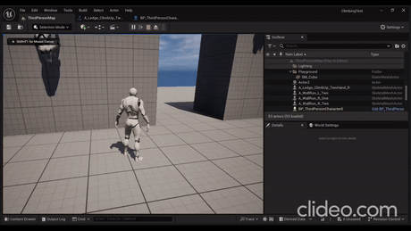
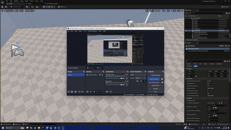

<h1 align="center">Hi, I'm Oleh Holoborodko 👋</h1>

  <b>Unreal Engine Gameplay Programmer</b> · C++ &amp; Blueprints 
  Building complex, responsive gameplay systems — movement, animation, physics, and dev tooling.

  
  
  

---

## 🎮 About me

Unreal Engine Gameplay Programmer with experience building complex gameplay systems in **C++** and **Blueprints** — focused on character movement, animation architecture, physics-based interactions, and developer tooling. I enjoy solving technical challenges that bridge realistic physics and fluid player control.

- 🔭 At **AEstelle Studios** I engineered a full player traversal suite (climbing, vaulting, wall-running, ledge transfers, IK ladder climbing) and a physics-driven impact system, working in a 4-person team.
- 🌱 Currently expanding into **IT systems &amp; network administration** through a Ciclo Formativo de Grado Medio (Information Technology).
- 🛠️ I like building tools that make iteration faster — in-engine dev panels, editor-time visualizers, modular animation architectures.

---

## 🧰 Tech & Tools

**Focus areas:** Gameplay Framework · Animation Systems · Character Movement · Physics Simulation · Editor Tooling

---

## 🎬 Gameplay showcase

Gameplay systems I built at **AEstelle Studios** in C++ / Unreal Engine.

### 🏃 Traversal & parkour
A suite of player movement mechanics — climbing, vaulting, and wall-running/jumping — with context-aware obstacle detection. The red surface markers in the wall-jump clip are my editor-time parkour-surface visualizer.

  
  

  

### 💥 Physics-driven impact reactions
Calculates precise hit direction and distributes force across affected body parts and nearby bones — the red vector shows the computed impact:

  

---

## 🚀 Featured projects

### 🖱️ [Keyboard To Mouse (K2M)](https://github.com/QuiToRiQ/K2M)
Desktop utility that maps keyboard input to mouse actions — navigate, edit, and control your workspace without ever leaving the keyboard.

<!-- Add a short demo gif here: drag a .gif into the repo and reference it -->
<!--  -->

### ♟️ [Dōbutsu Shōgi — Your Miniature Chess Adversary](https://github.com/QuiToRiQ/Your-Miniature-Chess-Adversary)
A full Dōbutsu Shōgi game for **RP2040 / Arduino**: AI opponent, capture-and-drop mechanics, piece promotion, and a LittleFS-based save system that persists game state across power cycles.

<!--  -->

---

## 📊 GitHub stats

  
  

---

## 📫 Get in touch

- 📧 **Email:** oleh.work.address@gmail.com
- 💼 **LinkedIn:** [oleh-holoborodko](https://linkedin.com/in/oleh-holoborodko)
